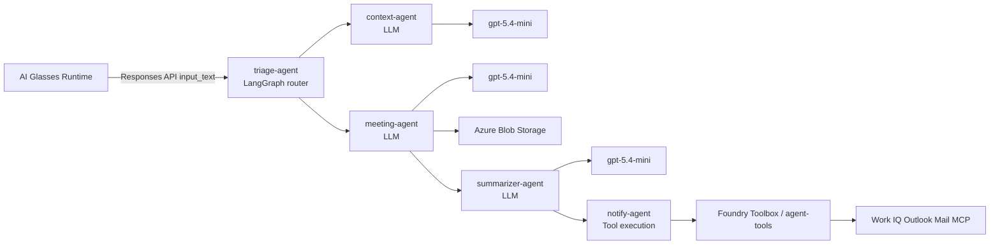
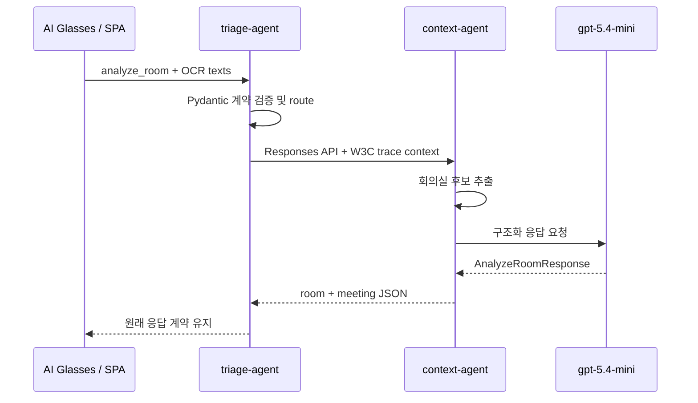
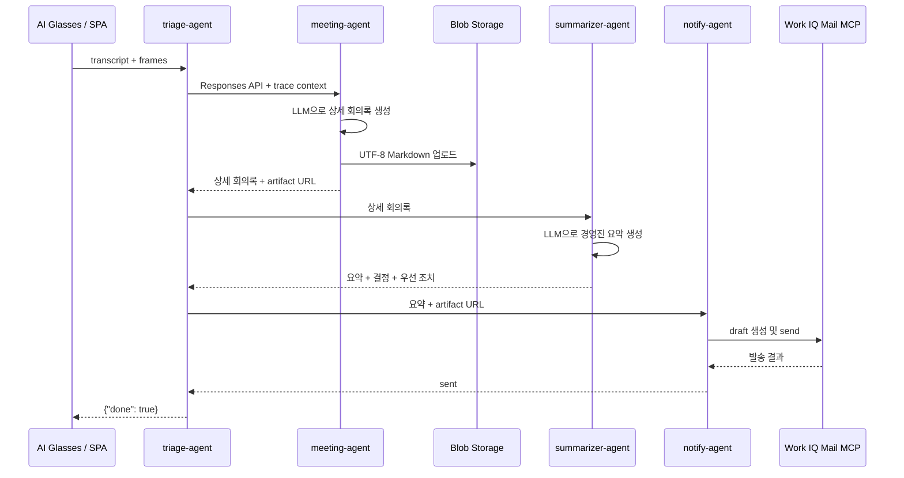

# AI Glasses Microsoft Foundry Meeting Agent Demo

AI Glasses Runtime의 회의 계약을 다섯 개 Microsoft Foundry Hosted Agent로 구현한 데모입니다. LangChain/LangGraph 기반 Triage 및 specialist Agent, `gpt-5.4-mini`, Blob Storage, Work IQ Mail, Application Insights를 Korea Central에 배포합니다.

## LLM과 LangChain 사용 범위

Hosted Agent는 Foundry의 독립적인 배포 및 실행 단위입니다. Hosted Agent라고 해서 반드시 자체적으로 LLM을 호출하는 것은 아닙니다.

| Hosted Agent | LangChain / LangGraph 기반 | `gpt-5.4-mini` 직접 호출 | 역할 |
|---|---|---:|---|
| `triage-agent` | 예 | 아니요 | 계약 검증, 분기, specialist Responses endpoint 호출 |
| `context-agent` | 예 | 예 | OCR 및 demo calendar 기반 회의실·회의 맥락 생성 |
| `meeting-agent` | 예 | 예 | transcript 기반 장문 회의록 생성 및 Blob 저장 |
| `summarizer-agent` | 예 | 예 | 장문 회의록을 메일용 경영진 요약으로 축약 |
| `notify-agent` | 예 | 아니요 | Work IQ Outlook Mail MCP 도구로 메일 발송 |

다섯 Agent 모두 `LangGraph` graph와 `ResponsesHostServer`를 사용하는 LangChain 생태계 기반 구현입니다. 다만 LLM을 직접 사용하는 Agent는 `context-agent`, `meeting-agent`, `summarizer-agent` 세 개입니다. `triage-agent`는 결정론적 orchestration graph이고, `notify-agent`는 LLM 없이 Foundry Toolbox 도구를 실행하는 graph입니다.

LLM 호출 경로는 [runtime.py](src/meeting-agent/meeting_agent/runtime.py)의 `build_chat_model()`에서 시작합니다. `DefaultAzureCredential`로 Foundry token을 얻고 `AIProjectClient.get_openai_client()`의 endpoint를 `ChatOpenAI`에 연결한 뒤, [specialists.py](src/meeting-agent/meeting_agent/specialists.py)의 `create_agent()`에 전달합니다.

## 동작



- `analyze_room`: Triage가 `context-agent`를 호출해 OCR 텍스트와 demo 일정 기반 회의 정보를 반환합니다.
- `summarize_meeting`: `triage-agent`가 `meeting-agent` → `summarizer-agent` → `notify-agent`를 순서대로 호출합니다.
- 전체 회의록: `meeting-agent`가 회의 목적, 전체 개요, 주제별 상세 논의와 결론, 결정, 조치, 리스크, 미해결 질문, 후속 계획, 시각 자료, 전체 원문 기록을 UTF-8 Markdown으로 생성합니다. Blob 쓰기 권한은 이 Agent에만 있습니다.
- 메일 요약: `summarizer-agent`가 전체 회의록을 2~4문장의 핵심 요약과 최대 5개의 주요 결정/우선 조치로 축약합니다. `notify-agent`는 이 축약본과 전체 회의록 링크만 Work IQ Mail로 발송합니다.

### Workflow 상세

`analyze_room` 실행 순서:



`summarize_meeting` 실행 순서:



## 소스 코드 구조

```text
.
|-- azure.yaml                         # Model, 5개 Agent, deploy hook
|-- index.html                         # AI Glasses demo SPA
|-- infra/
|   |-- meeting-storage/               # Blob Storage Bicep
|   `-- observability/                 # Log Analytics와 App Insights Bicep
|-- scripts/                           # Provision, RBAC, E2E, Trace 스크립트
|-- src/meeting-agent/
|   |-- main.py                        # triage-agent entrypoint
|   |-- context_main.py                # context-agent entrypoint
|   |-- meeting_notes_main.py          # meeting-agent entrypoint
|   |-- summarizer_main.py             # summarizer-agent entrypoint
|   |-- notify_main.py                 # notify-agent entrypoint
|   `-- meeting_agent/                 # 공용 graph와 adapter
`-- tests/                             # 계약, orchestration, 저장, 메일 테스트
```

### Agent entrypoint

| 파일 | 설명 |
|---|---|
| [main.py](src/meeting-agent/main.py) | `FoundryAgentClient`와 `TriageWorkflow`를 조립합니다. Model을 만들지 않으므로 Triage 자체는 LLM을 호출하지 않습니다. |
| [context_main.py](src/meeting-agent/context_main.py) | Foundry chat model과 Context graph를 조립합니다. |
| [meeting_notes_main.py](src/meeting-agent/meeting_notes_main.py) | Foundry chat model, Blob repository, 장문 회의록 graph를 조립합니다. |
| [summarizer_main.py](src/meeting-agent/summarizer_main.py) | Foundry chat model과 경영진 요약 graph를 조립합니다. |
| [notify_main.py](src/meeting-agent/notify_main.py) | Mail adapter와 tool-execution graph를 조립합니다. Model을 만들지 않습니다. |

각 entrypoint의 compiled LangGraph는 `langchain_azure_ai.agents.hosting.ResponsesHostServer`로 제공되어 Foundry Hosted Agent의 Responses endpoint가 됩니다.

### 공용 모듈

| 파일 | 설명 |
|---|---|
| [triage.py](src/meeting-agent/meeting_agent/triage.py) | 외부 계약을 파싱하고 `context` 또는 `notes → summarize → notify` 경로를 선택하는 production orchestration graph입니다. |
| [specialists.py](src/meeting-agent/meeting_agent/specialists.py) | Context, Meeting, Summarizer의 `create_agent()`와 Notify graph를 정의하고 Pydantic 구조화 출력을 검증합니다. |
| [remote.py](src/meeting-agent/meeting_agent/remote.py) | specialist Responses endpoint를 keyless 인증으로 호출하고 Foundry header와 W3C `traceparent`/`tracestate`를 전달합니다. |
| [runtime.py](src/meeting-agent/meeting_agent/runtime.py) | Foundry-backed `ChatOpenAI`, Blob/local repository, Work IQ/local mailer, Responses server factory를 제공합니다. |
| [contracts.py](src/meeting-agent/meeting_agent/contracts.py) | 입력 discriminator, 외부 응답, 상세 회의록, 메일 요약 Pydantic schema와 입력 크기·URL 검증을 정의합니다. |
| [storage.py](src/meeting-agent/meeting_agent/storage.py) | 상세 Markdown 렌더링과 local/Blob adapter를 구현합니다. Blob 접근에는 `DefaultAzureCredential`을 사용합니다. |
| [mail.py](src/meeting-agent/meeting_agent/mail.py) | local outbox와 Foundry Toolbox mail adapter를 구현합니다. 가능한 경우 draft-create 후 send를 수행합니다. |
| [workflow.py](src/meeting-agent/meeting_agent/workflow.py) | 공용 message/OCR helper와 local 단일-process reference graph를 제공합니다. 실제 Azure multi-agent 경로는 `triage.py`와 `specialists.py`입니다. |

### 배포 및 운영 파일

| 경로 | 설명 |
|---|---|
| [azure.yaml](azure.yaml) | Model과 다섯 Hosted Agent의 entrypoint, resource, 환경 변수, deploy hook을 선언합니다. |
| [infra/meeting-storage](infra/meeting-storage) | private Blob Storage와 `meeting-minutes` container를 생성합니다. |
| [infra/observability](infra/observability) | Log Analytics와 workspace-based Application Insights를 생성합니다. |
| [scripts/deploy-and-e2e.ps1](scripts/deploy-and-e2e.ps1) | 인프라 준비, RBAC, Agent 순차 배포, E2E를 수행합니다. |
| [scripts/provision-observability.ps1](scripts/provision-observability.ps1) | Foundry 프로젝트에 `ApplicationInsights` connection을 만들고 조회 권한을 설정합니다. |
| [scripts/query-traces.ps1](scripts/query-traces.ps1) | 최근 telemetry를 Operation ID와 Agent별로 집계합니다. |

## 전제 조건

- Azure CLI와 Azure Developer CLI 1.27 이상
- Python 3.13
- Foundry project와 관련 Azure resource를 만들 수 있는 Azure 구독
- Work IQ live mail 사용 시 Microsoft 365 Copilot 라이선스와 Entra 관리자 동의

로그인을 확인합니다.

```powershell
az account show --query "{user:user.name, subscription:name, id:id}"
azd auth login --check-status
```

## 배포

실제 Blob과 Work IQ Mail 연결을 idempotent하게 구성하고, `predeploy` 오케스트레이터가 RBAC를 먼저 적용한 뒤 다섯 Agent를 순차 배포하고 자동 E2E 테스트를 실행합니다.

```powershell
azd up
```

`azd up`의 마지막 `postup` 단계에는 현재 Triage endpoint가 자동 입력된 SPA의 로컬 `file:///.../index.html?endpoint=...` 링크와 `Deployment E2E test passed.`가 표시됩니다. VS Code terminal에서 SPA 링크를 클릭해 브라우저로 열고 access token만 입력하면 두 버튼을 테스트할 수 있습니다.

`azd down --purge --force` 후에는 `postdown` hook이 다음 배포의 resource group 이름에 짧은 suffix를 추가합니다. Foundry account 이름은 resource group ID를 포함해 계산되므로, 삭제된 account의 data-plane tombstone을 재사용해 발생하는 `409 Conflict`를 피할 수 있습니다.

테넌트에서 Agent Tools 앱 또는 사용자 동의가 제한된 경우에만 [Work IQ 설정](docs/work-iq-setup.md)을 참고해 다음 복구 스크립트를 실행합니다.

```powershell
./scripts/enable-live-mail.ps1
```

## 호출 예시

```powershell
./scripts/smoke-test.ps1 -IncludeSummarize
```

이 스크립트는 [data/meeting-room.md](data/meeting-room.md)의 UTF-8 회의 데이터를 사용합니다.

응답 계약은 각각 다음과 같습니다.

```json
{"room":"회의실","meeting":{"title":"AI Glasses 엣지 런타임 운영 리뷰","start_in_min":0,"attendees":5,"agenda_brief":"..."}}
```

```json
{"done":true}
```

Blob 확인:

```powershell
az storage blob list --account-name (([Uri](azd env get-value AZURE_STORAGE_ACCOUNT_URL)).Host.Split('.')[0]) --container-name meeting-minutes --auth-mode login --output table
```

배포 시 현재 로그인 사용자에게 Storage account 범위의 `Storage Blob Data Reader`를 자동 부여합니다. Azure Portal에서 `meeting-minutes` 컨테이너를 처음 열 때 권한 오류가 보이면 IAM 전파에 몇 분이 걸릴 수 있으므로 잠시 후 새로고침합니다. `meeting-agent`에는 별도로 `Storage Blob Data Contributor`만 부여됩니다.

## Foundry 호출 추적

현재 Triage는 specialist Hosted Agent의 Responses endpoint를 직접 호출하므로 Foundry Build 화면에 선언적 Workflow canvas로 표시되지는 않습니다. 실행 순서는 Application Insights 기반 분산 Trace로 확인합니다.

`azd up`은 workspace-based Application Insights와 Log Analytics를 생성하고 Foundry 프로젝트의 `ApplicationInsights` connection으로 연결합니다. 로그인 사용자와 프로젝트 identity의 Monitoring/Log Analytics 읽기 역할도 함께 설정합니다.

1. Microsoft Foundry에서 현재 프로젝트를 엽니다.
2. 왼쪽 메뉴에서 **Agents**, 상단에서 **Traces**를 선택합니다.
3. SPA에서 회의를 한 번 실행하고 2~5분 뒤 **Traces**를 새로고침합니다.
4. SPA 응답 영역에 표시되는 `Response ID` 또는 호출 로그의 `Trace ID`로 검색합니다.

Hosted Agent server-side trace는 연결 후 자동 수집됩니다. `triage-agent`는 specialist HTTP 호출에 `x-agent-foundry-call-id`와 W3C OpenTelemetry `traceparent`/`tracestate`를 함께 전달하므로 Agent 간 요청을 분산 Trace로 상관 분석할 수 있습니다. Trace에는 입력, 출력, 도구 인수가 포함될 수 있으므로 운영 데이터의 보존 기간과 접근 권한을 함께 검토합니다.

정상적인 Operation ID에는 다음 Agent가 함께 나타납니다.

- `analyze_room`: `triage-agent`, `context-agent`
- `summarize_meeting`: `triage-agent`, `meeting-agent`, `summarizer-agent`, `notify-agent`

최근 Trace를 Agent 및 telemetry table별로 집계합니다.

```powershell
./scripts/query-traces.ps1 -Minutes 30
```

smoke test 또는 `azd ai agent invoke` 출력에서 확인한 특정 Trace ID만 조회할 수 있습니다.

```powershell
./scripts/query-traces.ps1 `
    -Minutes 60 `
    -TraceId "<32-character-trace-id>"
```

Application Insights의 **Logs**에서는 다음 KQL로 원본 span을 확인할 수 있습니다.

```kusto
union isfuzzy=true withsource=TableName AppRequests, AppDependencies, AppTraces
| where TimeGenerated > ago(30m)
| extend AgentName = tostring(parse_json(Properties)['gen_ai.agent.name'])
| where AgentName in (
        'triage-agent',
        'context-agent',
        'meeting-agent',
        'summarizer-agent',
        'notify-agent'
)
| project TimeGenerated, OperationId, ParentId, AgentName, TableName, Name, Success
| order by TimeGenerated asc
```

특정 실행만 보려면 `project` 앞에 `| where OperationId == '<trace-id>'`를 추가합니다. `OTEL_INSTRUMENTATION_GENAI_CAPTURE_MESSAGE_CONTENT=true`인 demo 설정에서는 prompt, 응답, tool argument가 수집될 수 있습니다. 실제 운영에서는 민감 정보 정책과 보존 기간을 검토하고 필요하면 content capture를 비활성화합니다.

## SPA 클라이언트

[index.html](index.html)을 브라우저에서 열고 Responses endpoint와 `https://ai.azure.com/.default` scope의 사용자 access token을 입력합니다. **회의실 입장**은 `analyze_room`, **회의 종료 및 발송**은 `summarize_meeting` 계약을 호출합니다. Token은 브라우저 메모리에만 유지됩니다.

```powershell
az account set --subscription $(azd env get-value AZURE_SUBSCRIPTION_ID)
az account get-access-token --scope https://ai.azure.com/.default --query accessToken -o tsv
```

403 응답이 발생하면 기존 token을 재사용하지 말고 위 명령으로 현재 AZD subscription을 선택한 뒤 token을 다시 발급합니다. `azd up`이 출력하는 SPA 링크는 배포 tenant를 포함하며, SPA는 token의 audience, tenant, 만료 시간을 호출 전에 검증합니다.

## 로컬 개발

별도 가상환경을 권장합니다.

```powershell
python -m venv .venv
./.venv/Scripts/Activate.ps1
python -m pip install -r requirements-dev.txt
```

프로비저닝 후 `F5`에서 **Debug Meeting Agent with Inspector**를 실행하면 fake Blob/mail 모드로 Agent Inspector가 열립니다.

품질 검사:

```powershell
python -m ruff check src tests
python -m mypy
python -m pytest -q
az bicep build --file infra/meeting-storage/main.bicep
azd ai agent doctor
```

## 정리

```powershell
azd down --purge --force
```

Work IQ Outlook Mail Toolbox는 Foundry 프로젝트와 함께 삭제됩니다. `enable-live-mail.ps1`가 만든 Agent Tools service principal과 사용자 delegated consent는 Microsoft Entra 객체이므로 필요하면 별도로 정리합니다.